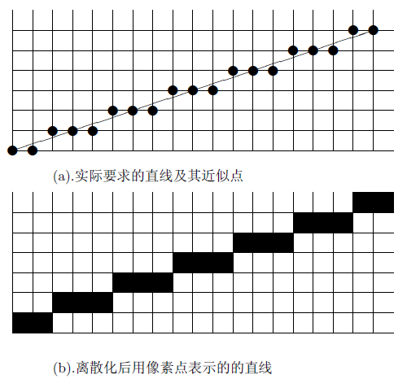
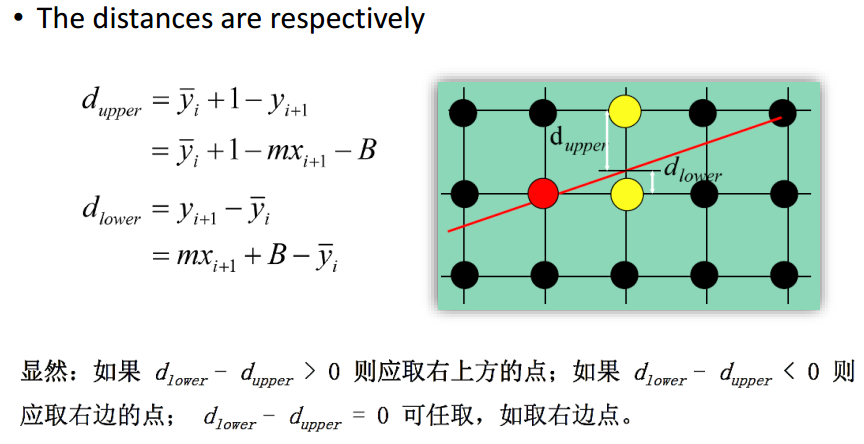
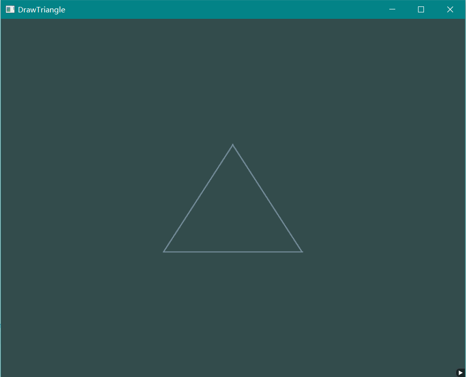
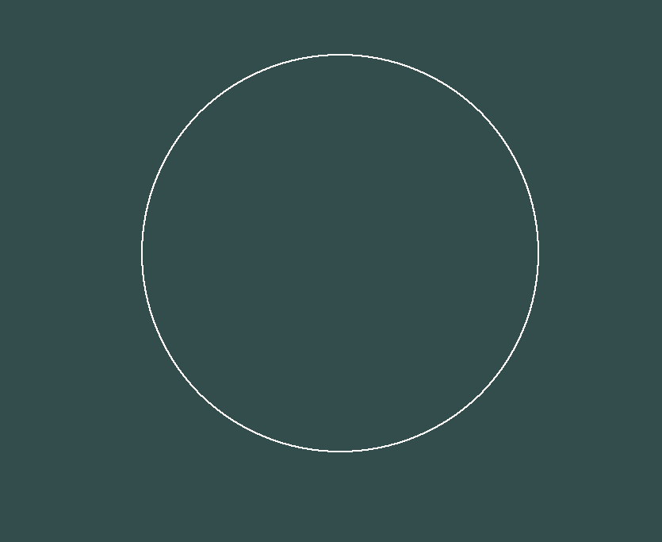
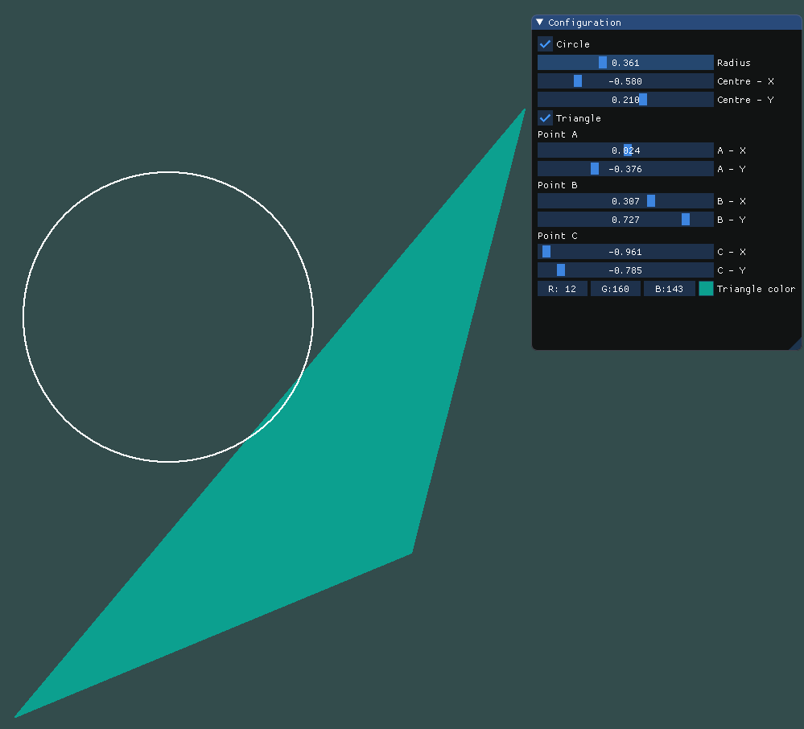

# Homework 3 - Draw Line

**16340256 谢玮鸿**  

### 1. 使用Bresenham算法(只使用integer arithmetic)画一个三角形边框：input为三个2D点；output三条直线（要求图元只能用 GL_POINTS ，不能使用其他，比如 GL_LINES 等）。  

基于上一次作业的配置绘制三角形，这样画点以及ImGui的使用都会方便很多。  

简单来说，计算机显示的精度有限，不可能真正显示连续的直线，于是通过Bresenham算法用一系列离散化后的点（像素）来近似表现这条直线。  
  
如图，对点的选择取决于 $d_{upper}$ 和 $d_{lower}$ 孰大孰小，引入决策参数 $p = \Delta x(d_{lower} - d_{upper} ) $进行判断。讨论斜率在(0,1)之间的情况，$p_i \leq 0$ 时，选择点$(x_i + 1, y_i)$ , $y_{i+1} - y_i = 0$， 则$p_{i+1} = p_i + 2 \Delta y$ ; $p_i > 0$ 时，选择点$(x_i + 1, y_i + 1)$，$y_{i+1} - y_i = 1$， 则$p_{i+1} = p_i + 2 \Delta y - 2 \Delta x$.  其他不同的斜率根据对称性质稍作变化即可。


Bresenham核心算法代码：  
``` c++
// bresenham算法，递归调用
//		p为决策参数，i为当前元素下标
void bresenham(int arr[], int p, int i, int length, int dx, int dy) {
	if (i + 1 >= length)
		return;
	int next;
	if (p < 0) {
		arr[i + 1] = arr[i];
		next = p + 2 * dy;
	}
	else {
		arr[i + 1] = arr[i] + 1;
		next = p + 2 * dy - 2 * dx;
	}
	bresenham(arr, next, i + 1, length, dx, dy);
}
```

考虑不同斜率的情况，做不同的调整。比如斜率在(0,1)之间和在（-1,0）之间的情况类似，处理(-1,0)的直线时，可以将p和dy取反，这样会得到一个关于x轴对称的直线点序列，再将纵坐标序列取反，就能得到目标直线了。注意要考虑斜率不存在的情况。  
``` c++
if (x1 == x2) {
		// #1. 斜率不存在
		if (y1 > y2)
			swap(y1, y2);
		length = y2 - y1;
		for (int i = 0; i < length; i++) {
			x_arr[i] = x1;
			y_arr[i] = y1 + i;
		}
	}
	else {
		float m = float(y2 - y1) / float(x2 - x1);
		// 交换点的位置，方便计算
		if ((fabs(m) < 1 && x1 > x2) || (fabs(m) > 1 && y1 > y2)) {
			swap(x1, x2);
			swap(y1, y2);
		}
		dx = x2 - x1;
		dy = y2 - y1;

		// #2. 斜率 |m| <= 1  , 即 dx >= dy， 对每个x取样
		if (fabs(m) <= 1) {
			length = x2 - x1 + 1;
			int p = 2 * dy - dx;
			for (int i = 0; i < length; i++)
				x_arr[i] = x1 + i;

			if (m >= 0) {
			    // #2.1 斜率在 0 - 1 之间
				y_arr[0] = y1;
				bresenham(y_arr, p, 0, length, dx, dy);
			}
			else {
			    // #2.2 斜率在 -1 - 0 之间，关于x轴对称一次即可
				p = -p;
				y_arr[0] = -y1;
				bresenham(y_arr, p, 0, length, dx, -dy);
				for (int i = 0; i < length; i++)
					y_arr[i] = -y_arr[i];
			}
		}
		else {
		// #3. 斜率 |m| > 1  , 即 dy > dx， 对每个y取样
			length = y2 - y1 + 1;
			int p = 2 * dx - dy;
			for (int i = 0; i < length; i++)
				y_arr[i] = y1 + i;

			if (m > 0) {
			    // #3.1 斜率大于1
				x_arr[0] = x1;
				bresenham(x_arr, p, 0, length, dy, dx);
			}
			else {
			    // #3.2 斜率小于-1，关于y轴对称一次即可
				p = -p;
				x_arr[0] = -x1;
				bresenham(x_arr, p, 0, length, dy, -dx);
				for (int i = 0; i < length; i++)
					x_arr[i] = -x_arr[i];
			}
		}
	}
```  
这样就获得了 x_arr 和 y_arr 两个序列，将这两个序列的点绘制出来，即可得到一条直线。将输入的三个点两两绘制成线，即可得到题目要求的三角形。  
  

---

### 2. 使用Bresenham算法(只使用integer arithmetic)画一个圆：input为一个2D点(圆心)、一个integer半径; output为一个圆。  

和绘制直线差不多，只是通过数学计算得到不同的决策参数p，具体算法原理我参照了 [Bresenham 画图算法原理](https://blog.csdn.net/sinat_41104353/article/details/82961824) 。

将要绘制的圆分为8等分，以(0, R)作为起始点，即$x_1 = 0, y_1 = R$，决策参数 $p_i = 2(x_i + 1)^2+ 2y_i^2 - 2y_i - 2R^2 + 1$ . 代入计算可得 $p_1 = 3 - 2R$. $p_i > 0$时，选择点$(x_i + 1, y_i - 1)$，$p_{i+1}=p_i + 4(x_i - y_i) + 10$ ; $p_i \leq 0$时，选择点$(x_i + 1, y_i)$，$p_{i+1}=p_i + 4x_i + 6$ .

得到的点加上圆心(cx, cy)，即可得到所求得1/8圆弧，其余7个部分通过对称可得。

Bresenham核心算法代码：
``` c++
int drawCircle(int x_arr[], int y_arr[], int R, int cx, int cy) {
	int x = 0, y = R, p = 3 - 2 * R;
	int i = 0;
	
	for (; x <= y; x++, i += 8) {
		x_arr[i] = x_arr[i + 1] = cx + x;
		x_arr[i + 2] = x_arr[i + 3] = cx - x;
		x_arr[i + 4] = x_arr[i + 5] = cx + y;
		x_arr[i + 6] = x_arr[i + 7] = cx - y;

		y_arr[i] = y_arr[i + 2] = cy + y;
		y_arr[i + 1] = y_arr[i + 3] = cy - y;
		y_arr[i + 4] = y_arr[i + 6] = cy + x;
		y_arr[i + 5] = y_arr[i + 7] = cy - x;
		if (p >= 0) {
			p += 4 * (x - y);
			y--;
		}
		else 
			p += 4 * x + 6;
	}
	return i;
}
```

  

---

### 3.在GUI在添加菜单栏，可以选择是三角形边框还是圆，以及能调整圆的大小(圆心固定即可)。  
添加一些单选框、滑动条，可以选择三角形和圆的显示、调整圆的大小和位置、三角形三个点的位置 以及 三角形的填充颜色。
``` c++
		// ImGui初始化 - 设置 - 渲染
		ImGui_ImplOpenGL3_NewFrame();
		ImGui_ImplGlfw_NewFrame();
		ImGui::NewFrame();

		ImGui::Begin("Configuration");
		ImGui::Checkbox("Circle", &show_circle);            // 是否显示圆
		ImGui::SliderFloat("Radius", &radius, 0.0f, 1.0f);  // 圆的半径
		ImGui::SliderFloat("Centre - X", &cx, -1.0f, 1.0f); // 圆心横坐标
		ImGui::SliderFloat("Centre - Y", &cy, -1.0f, 1.0f); // 圆心纵坐标

		ImGui::Checkbox("Triangle", &show_triangle);        // 是否显示三角形
		ImGui::Text("Point A");
		ImGui::SliderFloat("A - X", &x1, -1.0f, 1.0f);      // 点A 横坐标
		ImGui::SliderFloat("A - Y", &y1, -1.0f, 1.0f);      // 点A 纵坐标
		ImGui::Text("Point B");
		ImGui::SliderFloat("B - X", &x2, -1.0f, 1.0f);      // 点B 横坐标
		ImGui::SliderFloat("B - Y", &y2, -1.0f, 1.0f);      // 点B 纵坐标
		ImGui::Text("Point C");
		ImGui::SliderFloat("C - X", &x3, -1.0f, 1.0f);      // 点C 横坐标
		ImGui::SliderFloat("C - Y", &y3, -1.0f, 1.0f);      // 点C 纵坐标
		ImGui::ColorEdit3("Triangle color", (float*)&tri_color);    // 三角形填充颜色
		ImGui::End();

		ImGui::Render();
		int s_width, s_height;
		glfwMakeContextCurrent(window);
		glfwGetFramebufferSize(window, &s_width, &s_height);	// 根据窗口的缓冲大小获取尺寸
		glViewport(0, 0, s_width, s_height);
		ImGui_ImplOpenGL3_RenderDrawData(ImGui::GetDrawData());
```

更多演示结果可以参看视频文件。  


---

### Bonus. 使用三角形光栅转换算法，用和背景不同的颜色，填充你的三角形。  
三角形光栅化的方法有很多，我参照了一下博客 [Bresenham算法与三角形光栅化](http://richbabe.top/2018/06/22/Bresenham%E7%AE%97%E6%B3%95%E4%B8%8E%E4%B8%89%E8%A7%92%E5%BD%A2%E5%85%89%E6%A0%85%E5%8C%96/)，博客介绍了面积法、内角和法、同向法 和 重心法。  

个人感觉重心法比较方便，我的思路是选择三角形的一个点A作为坐标原点，则AB、AC可以表示为两个向量，且线性不相关，那么该平面的点都可以用向量$p = aAB + bAC$来表示。值得注意的是，当$a,b>0 且 a+b \leq1$时，该点则落在三角形里面。  

根据上述原理，点A为$(x_1, y_1)$,将AB表示为$(u_x, u_y)$, 将AC表示为$(v_x, v_y)$, 平面内一点表示为$(x, y)$，列出二元方程组：
$x = a * u_x + b * v_x + x_1$  
$y = a * u_y + b * v_y + y_1$  
解得  
$a = \frac{x  u_y - y  u_x + y_1  u_x - x_1  u_y}{v_x  u_y - u_x  v_y}, b = \frac{x  v_y - y  v_x + y_1  v_x - x_1  v_y}{u_x  v_y - v_x  u_y}$  

只需要判断a、b的大小，即可知道(x,y)是否在三角形内，若是，则绘制点。另外，为了减少遍历次数，可以把遍历范围缩小到包含三角形的一个矩形即可，这里我是选择三个点横纵坐标的最大最小值确定的。

``` c++
	// 矩阵中的任意一点可以用 向量au + bv 来表示， 若 a+b <= 1 ， 则该点在三角形内
	for (int x = x_min; x <= x_max; x++)
		for (int y = y_min; y <= y_max; y++) {
			b = (float)(x * uy - y * ux + y1 * ux - x1 * uy) / (float)(vx * uy - ux * vy);
			a = (float)(x * vy - y * vx + y1 * vx - x1 * vy) / (float)(ux * vy - vx * uy);
			if (a + b <= 1 && a >= 0 && b >= 0) {
				x_arr[i] = x;
				y_arr[i] = y;
				i++;
				// ...
			}
		}
```

实现效果请看上一题。