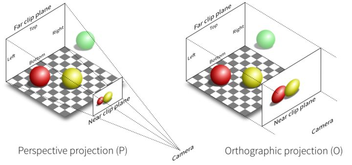

# Homework 5 - Transformation

**16340256 谢玮鸿**  

---

### Basic: 
> 1. 投影(Projection):  
> - 把上次作业绘制的cube放置在(-1.5, 0.5, -1.5)位置，要求6个面颜色不一致
> - 正交投影(orthographic projection)：实现正交投影，使用多组(left, right, bottom, top, near, far)参数，比较结果差异
> - 透视投影(perspective projection)：实现透视投影，使用多组参数，比较结果差异
> 2. 视角变换(View Changing):
> - 把cube放置在(0, 0, 0)处，做透视投影，使摄像机围绕cube旋转，并且时刻看着cube中心  
> 3. 在GUI里添加菜单栏，可以选择各种功能。

#### **（一）调整立方体**
上一次的作业中，我使用了EBO来减少同一个顶点重复调用的次数，以减少内存空间浪费，提高执行效率。但是如果要绘制6个不一样颜色的面，就是说一个顶点要用于绘制三个不同颜色的三角形，因此就去掉了EBO，改为如下：
```c++
	float vertices[] = {
		-1.0f, -1.0f, -1.0f,	0.8f, 0.6f, 0.4f,	// 后-1
		1.0f, -1.0f, -1.0f,		0.8f, 0.6f, 0.4f,
		1.0f,  1.0f, -1.0f,		0.8f, 0.6f, 0.4f,

		-1.0f, -1.0f, -1.0f,	0.8f, 0.6f, 0.4f,	// 后-2
		1.0f,  1.0f, -1.0f,		0.8f, 0.6f, 0.4f,
		-1.0f,  1.0f, -1.0f,	0.8f, 0.6f, 0.4f,

		-1.0f, -1.0f,  1.0f,	0.4f, 0.6f, 0.8f,	// 前-1
		1.0f, -1.0f,  1.0f,		0.4f, 0.6f, 0.8f,
		1.0f,  1.0f,  1.0f,		0.4f, 0.6f, 0.8f,

		-1.0f, -1.0f,  1.0f,	0.4f, 0.6f, 0.8f,	// 前-2
		1.0f,  1.0f,  1.0f,		0.4f, 0.6f, 0.8f,
		-1.0f,  1.0f,  1.0f,	0.4f, 0.6f, 0.8f,

	    // .. 剩下四个面略
	};
```
绘制图元的时候将 `glDrawElements(GL_TRIANGLES, 36, GL_UNSIGNED_INT, 0);` 更改为 `glDrawArrays(GL_TRIANGLES, 0, 36);` 即可。`glDrawArrays`传输或指定的数据是最终的真实数据,在绘制时效能更好；而`glDrawElements`指定的是真实数据的调用索引,在内存/显存占用上更节省。  

然后将cube放置在(-1.5, 0.5, -1.5)位置。只要将变换矩阵model更改一下即可。  
``` c++
model = glm::translate(model, glm::vec3(-1.5f, 0.5f, -1.5f));
```  
绘制出来的效果如下 (摄像机在(0.0, 0.0, -6.0)的位置) ：  


---

#### **（二）使用正交投影/透视投影**  
不管是正交投影还是透视投影，最终都是将视景体内的物体投影在近平面上，这也是 3D 坐标转换到 2D 坐标的关键一步。  

正射投影矩阵定义了一个类似立方体的平截头箱，它定义了一个裁剪空间，在这空间之外的顶点都会被裁剪掉。平截头体由由宽、高、近(Near)平面和远(Far)平面所指定。任何出现在近平面之前或远平面之后的坐标都会被裁剪掉。

然而在实际生活中，你会注意到离你越远的东西看起来更小，这个效果称为透视(Perspective)。使用透视投影矩阵可以将给定的平截头体范围映射到裁剪空间，透视视角的视景体是一个锥形，从而使得离观察者越远的物体看起来越大。

两者的对比如下：  



**正交投影**  
将投影矩阵更改为 `projection = glm::ortho(orthoLeft, orthoRight, orthoBottom, orthoTop, orthoNear, orthoFar);` ，既可以创建一个正交投影矩阵。前四个参数用于调整平截头体的宽和高，第五、六个参数用于调整近平面和远平面的距离。在ImGui中可以调整这六个参数，查看不同效果。  

1. 参数 `(-5.0f, 5.0f, -5.0f, 5.0f, 0.1f, 100.0f)` :  
  
可见只有立方体的正面映射到裁剪空间上。

2. 参数 `(-20.0f, 20.0f, -20.0f, 20.0f, 0.1f, 100.0f)` :
  
可见平截头体的宽和高拉长后，观察到的立方体变小了。

3. 参数 `(-20.0f, 20.0f, -20.0f, 20.0f, 6.506f, 100.0f)` :
  
将近平面参数调到6.5左右，可以看到立方体的前面被裁剪掉了，投影出来的是立方体的后面。

**透视投影**  
将投影矩阵更改为 `projection = glm::perspective(glm::radians(45.0f), (float)SCR_WIDTH / (float)SCR_HEIGHT, 0.1f, 100.0f);` ， 既可以创建一个透视投影矩阵。第一个参数为fov，它表示的是视野(Field of View)，并且设置了观察空间的大小。如果想要一个真实的观察效果，它的值通常设置为45.0f。第二个参数设置了宽高比，由视口的宽除以高所得。第三和第四个参数设置了平截头体的近和远平面。

绘制出来的效果如下（摄像机位置在(0.0, 0.0, -6.0)），可以看到比较接近人的视觉效果，能看到立方体的右侧。  


将fov的值调整到60.0f，视角扩张得更大了，看到的范围更大。  


---

#### **（三）视角变换**  

观察矩阵把所有的世界坐标变换为相对于摄像机位置与方向的观察坐标。要定义一个摄像机，我们需要它在世界空间中的位置、观察的方向、一个指向它右测的向量以及一个指向它上方的向量。

要改变摄像机的位置，只需要改变观察矩阵。使用glm提供的LookAt矩阵作为观察矩阵可以很高效地把所有世界坐标变换到刚刚定义的观察空间。我们只需要定义一个摄像机位置，一个目标位置（摄像机要观察的目标）和一个表示世界空间中的上向量的向量（代表摄像机空间的z轴的正方向）。接着glm就会创建一个LookAt矩阵，作为观察矩阵。

下面的代码表示摄像机位置在(camX, 0.0f, camZ)，观察的目标在(0.0f, 0.0f, 0.0f)，摄像机的上向量(0.0f, 1.0f, 0.0f)代表摄像机的摆放角度。
```c++
view = glm::lookAt(glm::vec3(camX, 0.0f, camZ),		// camera position
	glm::vec3(0.0f, 0.0f, 0.0f),					// camera target
	glm::vec3(0.0f, 1.0f, 0.0f));					// camera up vector
```

那么关键的地方是camX和camZ的改变。在循环渲染的过程中，将其如下定义。这样，camX和camZ将会根据时间改变，而且满足$camX^2 + camZ^2 = radius^2$，即使得摄像机能够环绕目标(0.0f, 0.0f, 0.0f)在xOz平面上旋转。
```c++
float radius = 6.0f;
float camX = sin(glfwGetTime()) * radius;
float camZ = cos(glfwGetTime()) * radius;
```
实现效果请见演示视频。  

---

#### **（四）完善GUI**  
如上面的截图所示，添加菜单栏，使用户能够选择 摄像机是否环绕立方体旋转； 透视视角/正交视角； 透视视角下fov值的调整； 正交视角下6个参数的调整； 还有bonus下自由视角变换的选择。

---

#### **（五）关于ModelView Matrix**
在现实生活中，将 摄像机摆放空间View Matrix、拍摄物体摆设空间Model Matrix 以及 投影空间Projection Matrix 分开考虑是很自然的事情。但是在经典的OpenGL版本(OpenGL 1.x/2.x)中，OpenGL提供投影矩阵，却不提供观察矩阵或模型矩阵，而是提供一个组合起来的模型观察矩阵 ModelView Matrix。

从实际应用来看，发送的矩阵当然是越少越好，这样程序需要做的矩阵相乘运算就会减少，顶点着色器就会更快。  

但是，在投影的过程中可能还需要一些特定的过程。除非只是进行2D渲染或者一些简单的3D演示应用，否则应该是需要有光照的。这就意味着需要将位置(position)和法线(normals)转换到世界空间(world space)或观察坐标中(view space)，然后（在顶点着色器或片段着色器中）进行照明操作。然而照明操作无法在投影后的空间中进行，因为该空间是非线性的。这就意味着在模型到投影的过程中，至少要停留一次，完成照明操作。


最后，由于着色器在世界空间(world space)中工作可能会遇到转换导致的数值精度问题，而在观察空间(view space)中则不会（这与物体和摄像机之间的距离有关）。因此选择合并 ModelView Matrix 而不是 ViewProjection Matrix。  

总结来说，原因有三：  
1. 运算的矩阵越少越好；  
2. 由于添加光照的原因，需要在projection之前停留一次；  
3. 考虑到数值精度，选择将 ModelMatrix 和 ViewMatrix 合并。  

---

### Bonus: 
>  实现一个camera类，当键盘输入 w,a,s,d ，能够前后左右移动；当移动鼠标，能够视角移动("look around")，
即类似FPS(First Person Shooting)的游戏场景

定义三个全局变量 `cameraPos` , `cameraFront` , `cameraUp`。分别表示摄像机位置，摄像机对着目标的方向，摄像机的上向量。则cameraPos+cameraFront表示的是目标的位置。因此LookAt矩阵表示为`glm::lookAt(cameraPos, cameraPos + cameraFront, cameraUp);`

首先处理键盘的WASD输入。在先前的processInput函数中已经处理过ESC的输入（退出程序），在同一个函数中处理wasd输入即可。

WS分别表示向前向后，实现比较简单，只需要将摄像机的位置在cameraFront正/负方向上移动就行。AD分别表示向左向右，需要使用叉乘（上向量叉乘cameraFront）来创建一个右向量(Right Vector)，并将摄像机沿着它相应移动就可以了。因此完整的processInput函数如下：
```c++
void processInput(GLFWwindow *window)
{
	if (glfwGetKey(window, GLFW_KEY_ESCAPE) == GLFW_PRESS)
		glfwSetWindowShouldClose(window, true);

	float cameraSpeed = 0.1f; // adjust accordingly
	if (glfwGetKey(window, GLFW_KEY_W) == GLFW_PRESS)
		cameraPos += cameraSpeed * cameraFront;
	if (glfwGetKey(window, GLFW_KEY_S) == GLFW_PRESS)
		cameraPos -= cameraSpeed * cameraFront;
	if (glfwGetKey(window, GLFW_KEY_A) == GLFW_PRESS)
		cameraPos -= glm::normalize(glm::cross(cameraFront, cameraUp)) * cameraSpeed;
	if (glfwGetKey(window, GLFW_KEY_D) == GLFW_PRESS)
		cameraPos += glm::normalize(glm::cross(cameraFront, cameraUp)) * cameraSpeed;
}
```

然后是鼠标的视角移动，我们需要根据鼠标的移动改变cameraFront这个参数。欧拉角中的俯仰角(Pitch)、偏航角(Yaw)比较常用于处理摄像机的视角移动。俯仰角是描述往上或往下看的程度，偏航角表示往左和往右看的程度。


偏航角和俯仰角是通过鼠标移动获得的，水平的移动影响偏航角，竖直的移动影响俯仰角。原理是，储存上一帧鼠标的位置，在当前帧中我们当前计算鼠标位置与上一帧的位置相差多少。通过鼠标位置的变化计算偏航角/俯仰角的角度变化。

第一步，设置glfw隐藏光标，并捕捉光标。
```c++
glfwSetInputMode(window, GLFW_CURSOR, GLFW_CURSOR_DISABLED);
```

第二步，定义一个监听鼠标移动事件的回调函数。原型为`void mouse_callback(GLFWwindow* window, double xpos, double ypos)`，其中xpos和ypos表示鼠标的位置。由于要依靠上一帧的鼠标位置进行计算，因此定义两个全局变量`lastX`和`lastY`，记录上一帧的xpos和ypos的值，另外注意要判断第一次渲染的时候lastX和lastY应为当前的xpos和ypos。

计算出偏移量后，再根据三角关系就可以计算出新的cameraFront的三个分量分别是多少了。具体计算如下：
```c++
	float sensitivity = 0.05;
	yaw   += sensitivity * (xpos - lastX);
	pitch += sensitivity * (lastY - ypos);
	lastX = xpos;
	lastY = ypos;

	if (pitch > 89.0f)
		pitch = 89.0f;
	if (pitch < -89.0f)
		pitch = -89.0f;

	glm::vec3 front;
	front.x = cos(glm::radians(yaw)) * cos(glm::radians(pitch));
	front.y = sin(glm::radians(pitch));
	front.z = sin(glm::radians(yaw)) * cos(glm::radians(pitch));
	cameraFront = glm::normalize(front);
```
在渲染的时候调用该回调函数即可， 代码为 `glfwSetCursorPosCallback(window, mouse_callback)`。

具体的视角移动效果请看演示视频。