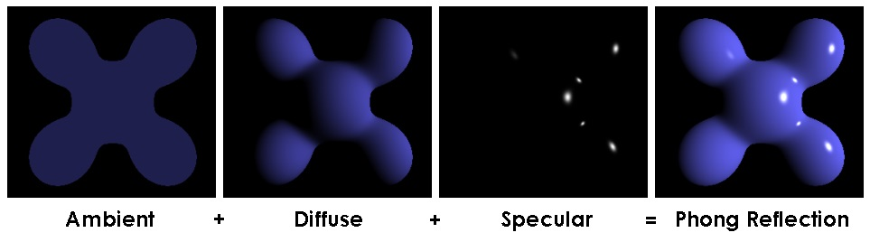

# Homework 6 - Lights and Shading

**16340256 谢玮鸿**  

---

### Basic: 
> 1. 实现Phong光照模型：
- 场景中绘制一个cube
- 自己写shader实现两种shading: Phong Shading 和 Gouraud Shading，并解释两种shading的实现原理
- 合理设置视点、光照位置、光照颜色等参数，使光照效果明显显示
2. 使用GUI，使参数可调节，效果实时更改：
- GUI里可以切换两种shading
- 使用如进度条这样的控件，使ambient因子、diffuse因子、specular因子、反光度等参数可调节，光照效
果实时更改

### Bonus:
> 当前光源为静止状态，尝试使光源在场景中来回移动，光照效果实时更改。

#### **（一）冯氏光照模型**  
冯氏光照模型的主要结构由3个分量组成：环境(Ambient)、漫反射(Diffuse)和镜面(Specular)光照。

- **环境光照(Ambient Lighting)**：环境光是场景中光源给定或者全局给定的一个光照常量，它一般很小，主要是为了模拟即使场景中没有光照时，也不是全部黑屏的效果。场景中总有一点环境光，不至于使场景全部黑暗，例如远处的月亮，远处的光源。 
- **漫反射光照(Diffuse Lighting)**：模拟光源对物体的方向性影响(Directional Impact)。它是冯氏光照模型中视觉上最显著的分量。物体的某一部分越是正对着光源，它就会越亮。
- **镜面光照(Specular Lighting)**：模拟有光泽物体上面出现的亮点。镜面光照的颜色相比于物体的颜色会更倾向于光的颜色。

三种光照的显示效果如下：  


(一) 环境光照  
环境光的实现如下：使用光的颜色乘以一个很小的常量环境因子，再乘以物体的颜色，然后将最终结果作为片段的颜色。这样子的话即便场景中没有直接的光源也能看起来存在有一些发散的光。
```c++
// 环境光成分
float   ambientStrength = 0.1f;
vec3    ambient = ambientStrength * lightColor * objectColor;
```

（二）漫反射光照  
漫反射光强度与光线入射方向和物体表面的法向量之间的夹角相关。当夹角等于0时，物体表面正好垂直于光线方向，这是获得的光照强度最大；当夹角等于90度时物体表面与光线方向平行，此时光线照射不到物体，光的强度最弱；当后，物体的表面转向到光线的背面，此时物体对应的表面接受不到光照。

因此，需要计算:   
1. 法向量：一个垂直于顶点表面的向量。
2. 入射光线：作为光源的位置与片段的位置之间向量差的方向向量。为了计算这个光线，我们需要光的位置向量和片段的位置向量。

方向向量可以通过让两个向量相减计算向量差。同时，希望确保所有相关向量最后都转换为单位向量，所以把法线和最终的方向向量都进行标准化。然后进行点乘计算，计算光源对当前片段实际的漫发射影响。结果值再乘以光的颜色，得到漫反射分量（要避免漫反射分量变为负数）。漫反射的实现如下：
```c++
// 漫反射成分
vec3 norm = normalize(Normal);
vec3 lightDir = normalize(lightPos - FragPos);
float diff = max(dot(norm, lightDir), 0.0);
vec3 diffuse = diff * lightColor;
```

（三）镜面光照  
和漫反射光照一样，镜面光照也是依据光的方向向量和物体的法向量来决定的，但是它也依赖于观察方向。通过反射法向量周围光的方向来计算反射向量。然后计算反射向量和视线方向的角度差，如果夹角越小，那么镜面光的影响就会越大。  
  
观察向量是镜面光照附加的一个变量，可以使用观察者世界空间位置和片段的位置来计算它。  
之后，使用reflect函数对lightDir向量进行了取反，获得反射方向。定义一个镜面强度(Specular Intensity)变量，给镜面高光一个中等亮度颜色，让它不要产生过度的影响。  
最后，计算镜面分量，首先计算视线方向与反射方向的点乘（并确保它不是负值），然后取它的32次幂。这个32是高光的反光度(Shininess)。一个物体的反光度越高，反射光的能力越强，散射得越少，高光点就会越小。
```c++
// 镜面光照 
vec3 viewDir = normalize(viewPos - fragPos);
vec3 reflectDir = reflect(-lightDir, norm);
float spec = pow(max(dot(viewDir, reflectDir), 0.0), shininessFactor);
vec3 specular = specularFactor * spec * lightColor;		
```

---

#### **（二）Phong Shading 和 Gouraud Shading 的异同**  
相同点：都是按照冯氏光照模型实现光照着色器
不同点：Gouraud Shading在顶点着色器中实现，而Phong Shading是在片段着色器中实现的。

优缺点对比：

- Phong Shading - 逐个片段计算着色，看起来更加自然，但是计算量比较大。
- Gouraud Shading - 在顶点着色器中，顶点会少很多，因此光照计算频率会更低，效率更高；但是片段颜色是由插值计算得的，顶点较少时光照会非常不真实。

---

#### **（三）更改为移动光源**  
实现很简单，只需要在每次渲染的时候更改lightPos的值即可更改位置。
``` c++
    // 光源
	if (spinningCamera) {
		lightPos.x = sin(glfwGetTime()) * 1.0f - 1.0f;
		lightPos.y = cos(glfwGetTime()) * 1.0f;
		lightPos.z = 0.0f;
	}
```

---

#### **（四）实验结果对比**  
具体实验结果请看演示视频，这里根据视频演示情况，给出对比结论。  

使用Phong Shading时：  
 
- ambientFactor : 数值越大，物体越亮。说明环境光越亮，物体越亮。
- diffuseFactor ： 数值越大，物体越亮。说明漫反射强度越强。
- specularFactor ： 数值越大，镜面效果越明显。
- shininess ：数值越大散射得越少，高光点越小。

使用Gouraud Shading时：
- ambientFactor : 数值越大，物体越亮。说明环境光越亮，物体越亮。
- diffuseFactor ： 数值越大，物体越亮。说明漫反射强度越强。
- specularFactor ： 不管如何调整，高光效果都很差，没有高光点，说明插值渲染的效果很差。
- shininess ：同样的，调整该参数并没有什么变化，高光效果依然很差。