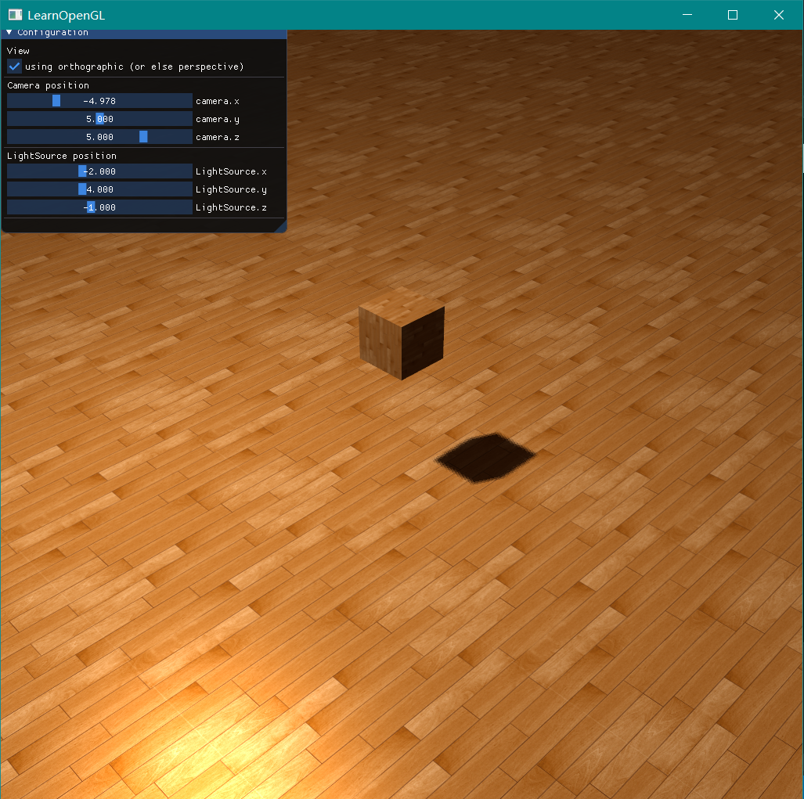

# Homework 7 - Shadowing Mapping

**16340256 谢玮鸿**  

---

### Basic: 
> 1. 实现方向光源的Shadowing Mapping:  
- 要求场景中至少有一个object和一块平面(用于显示shadow)
- 光源的投影方式任选其一即可  
- 在报告里结合代码，解释Shadowing Mapping算法  
2. 修改GUI

### Bonus:
> 1. 实现光源在正交/透视两种投影下的Shadowing Mapping  
2. 优化Shadowing Mapping (可结合References链接，或其他方法。优化方式越多越好，在报告里说明，有加分)

#### **（一）生成深度贴图(Depth Map)**  
深度贴图是从光的透视图里渲染的**深度纹理**，用它计算阴影。

第一步，创建一个帧缓冲对象以及一个2D纹理，2D纹理可作为帧缓冲的深度缓冲。
``` c++
	// 生成一张深度贴图(Depth Map)
	unsigned int depthMapFBO;
	glGenFramebuffers(1, &depthMapFBO);	// 创建帧缓冲对象

	// 创建一个2D纹理
	const unsigned int SHADOW_WIDTH = 1024, SHADOW_HEIGHT = 1024;
	unsigned int depthMap;
	glGenTextures(1, &depthMap);
	glBindTexture(GL_TEXTURE_2D, depthMap);
	glTexImage2D(GL_TEXTURE_2D, 0, GL_DEPTH_COMPONENT, SHADOW_WIDTH, SHADOW_HEIGHT, 0, GL_DEPTH_COMPONENT, GL_FLOAT, NULL);
	glTexParameteri(GL_TEXTURE_2D, GL_TEXTURE_MIN_FILTER, GL_NEAREST);
	glTexParameteri(GL_TEXTURE_2D, GL_TEXTURE_MAG_FILTER, GL_NEAREST);
	glTexParameteri(GL_TEXTURE_2D, GL_TEXTURE_WRAP_S, GL_REPEAT);
	glTexParameteri(GL_TEXTURE_2D, GL_TEXTURE_WRAP_T, GL_REPEAT);
	float borderColor[] = { 1.0, 1.0, 1.0, 1.0 };
	glTexParameterfv(GL_TEXTURE_2D, GL_TEXTURE_BORDER_COLOR, borderColor);
	
	// 把生成的深度纹理作为帧缓冲的深度缓冲
	glBindFramebuffer(GL_FRAMEBUFFER, depthMapFBO);
	glFramebufferTexture2D(GL_FRAMEBUFFER, GL_DEPTH_ATTACHMENT, GL_TEXTURE_2D, depthMap, 0);
	glDrawBuffer(GL_NONE);
	glReadBuffer(GL_NONE);
	glBindFramebuffer(GL_FRAMEBUFFER, 0);
```

第二步，在渲染过程中生成深度贴图。
``` c++
	// 2. 渲染场景
	glViewport(0, 0, SCR_WIDTH, SCR_HEIGHT);
	glClear(GL_COLOR_BUFFER_BIT | GL_DEPTH_BUFFER_BIT);
	shader.use();
	glm::mat4 projection = glm::perspective(glm::radians(45.0f), (float)SCR_WIDTH / (float)SCR_HEIGHT, 0.1f, 100.0f);
	glm::mat4 view = glm::lookAt(cameraPos, glm::vec3(0.0f, 0.0f, 0.0f), glm::vec3(0.0f, 1.0f, 0.0f));
	shader.setMat4("projection", projection);
	shader.setMat4("view", view);

	shader.setVec3("lightPos", lightPos);
	shader.setVec3("viewPos", cameraPos);
	shader.setMat4("lightSpaceMatrix", lightSpaceMatrix);
	glActiveTexture(GL_TEXTURE0);
	glBindTexture(GL_TEXTURE_2D, woodTexture);
	glActiveTexture(GL_TEXTURE1);
	glBindTexture(GL_TEXTURE_2D, depthMap);
	RenderScene(shader);
```

### **（二）光源空间的转换**  
如果假设光是平行光，则将为光源使用正交投影矩阵，透视图将没有任何变形（或者使用透视投影矩阵也行）。另外，为了创建一个视图矩阵来变换每个物体，把它们变换到从光源视角可见的空间中，将摄像机从光源的位置看向场景中央。二者相结合为我们提供了一个光空间的变换矩阵(lightSpaceMatrix)，它将每个世界空间坐标变换到光源处所见到的那个空间；这正是我们渲染深度贴图所需要的。
``` c++
	// 0. 将场景深度渲染至纹理，获取光照矩阵、观察矩阵
	glm::mat4 lightProjection = glm::mat4(1.0f), 
		lightView = glm::mat4(1.0f),
		lightSpaceMatrix = glm::mat4(1.0f);
	
	float near_plane = 1.0f, far_plane = 7.5f;
	
	// 使用正交/透视投影，进行光源空间的变换
	if (isOrtho)
		lightProjection = glm::ortho(-10.0f, 10.0f, -10.0f, 10.0f, near_plane, far_plane);
	else
		lightProjection = glm::perspective(glm::radians(45.0f), (GLfloat)SHADOW_WIDTH / (GLfloat)SHADOW_HEIGHT, near_plane, far_plane); 
		// lightProjection = glm::perspective(glm::radians(45.0f), (float)SHADOW_WIDTH / (float)SHADOW_HEIGHT, near_plane, far_plane);
	lightView = glm::lookAt(lightPos, glm::vec3(0.0f), glm::vec3(0.0, 1.0, 0.0));
	lightSpaceMatrix = lightProjection * lightView;
```

### **（三）渲染至深度贴图**  
以光的透视图进行场景渲染的时候，使用一个比较简单的着色器完成该任务，而这个着色器只需要把顶点变换到光空间。
``` c++
	simpleDepthShader.use();
	simpleDepthShader.setMat4("lightSpaceMatrix", lightSpaceMatrix);
	
	glViewport(0, 0, SHADOW_WIDTH, SHADOW_HEIGHT);
	glBindFramebuffer(GL_FRAMEBUFFER, depthMapFBO);
	glClear(GL_DEPTH_BUFFER_BIT);
	glActiveTexture(GL_TEXTURE0);
	glBindTexture(GL_TEXTURE_2D, woodTexture);
	RenderScene(simpleDepthShader);
	glBindFramebuffer(GL_FRAMEBUFFER, 0);
```

### **（四）渲染阴影**  
生成深度贴图以后就可以开始生成阴影了。生成代码的工作在片段着色器中执行，用来检验一个片元是否在阴影之中。不过首先要在顶点着色器中完成光空间的变换（此处略）。

片段着色器使用Blinn-Phong光照模型渲染场景。目的是要计算出一个shadow值，当fragment在阴影中时是1.0，在阴影外是0.0。然后，diffuse和specular颜色会乘以这个阴影元素。

shadow_mapping的片段着色器代码如下。阴影渲染最关键的步骤就是这里，其具体思路是：

 1. 把光空间片元位置转换为裁切空间的标准化设备坐标：进行一个透视除法，将裁切空间坐标的范围-w到w转为-1到1；
 2. 因为来自深度贴图的深度在0到1的范围，因此使用projCoords从深度贴图中去采样，所以我们将NDC坐标变换为0到1的范围；
 3. 得到光的位置视野下最近的深度，并计算片元的当前深度；
 4. 简单检查currentDepth是否高于closetDepth，如果是，那么片元就在阴影中。
 

``` c++
#version 330 core
out vec4 FragColor;

in VS_OUT {
    vec3 FragPos;
    vec3 Normal;
    vec2 TexCoords;
    vec4 FragPosLightSpace;
} fs_in;

uniform sampler2D diffuseTexture;
uniform sampler2D shadowMap;

uniform vec3 lightPos;
uniform vec3 viewPos;

float ShadowCalculation(vec4 fragPosLightSpace)
{
	// 执行透视除法
    vec3 projCoords = fragPosLightSpace.xyz / fragPosLightSpace.w;

    // 变换到[0,1]的范围
    projCoords = projCoords * 0.5 + 0.5;

    // 取得最近点的深度(使用[0,1]范围下的fragPosLight当坐标)
    float closestDepth = texture(shadowMap, projCoords.xy).r; 

    // 取得当前片元在光源视角下的深度
    float currentDepth = projCoords.z;


    // 计算阴影偏移
    vec3 normal = normalize(fs_in.Normal);
    vec3 lightDir = normalize(lightPos - fs_in.FragPos);
    float bias = max(0.05 * (1.0 - dot(normal, lightDir)), 0.005);

    // 检查当前片元是否在阴影中
    // float shadow = currentDepth - bias > closestDepth  ? 1.0 : 0.0;

    // PCF
    float shadow = 0.0;
    vec2 texelSize = 1.0 / textureSize(shadowMap, 0);
    for(int x = -1; x <= 1; ++x)
    {
        for(int y = -1; y <= 1; ++y)
        {
            float pcfDepth = texture(shadowMap, projCoords.xy + vec2(x, y) * texelSize).r; 
            shadow += currentDepth - bias > pcfDepth  ? 1.0 : 0.0;        
        }    
    }
    shadow /= 9.0;
    if(projCoords.z > 1.0)
        shadow = 0.0;
        
    return shadow;
}

void main()
{           
    vec3 color = texture(diffuseTexture, fs_in.TexCoords).rgb;
    vec3 normal = normalize(fs_in.Normal);
    vec3 lightColor = vec3(1.0);

    // Ambient - 环境
    vec3 ambient = 0.3 * color;

    // Diffuse - 漫反射
    vec3 lightDir = normalize(lightPos - fs_in.FragPos);
    float diff = max(dot(lightDir, normal), 0.0);
    vec3 diffuse = diff * lightColor;
    
	// Specular - 镜面反射
    vec3 viewDir = normalize(viewPos - fs_in.FragPos);
    vec3 reflectDir = reflect(-lightDir, normal);
    float spec = 0.0;
    vec3 halfwayDir = normalize(lightDir + viewDir);  
    spec = pow(max(dot(normal, halfwayDir), 0.0), 64.0);
    vec3 specular = spec * lightColor;  
	
    // 计算阴影
    float shadow = ShadowCalculation(fs_in.FragPosLightSpace);       
    vec3 lighting = (ambient + (1.0 - shadow) * (diffuse + specular)) * color;    

    FragColor = vec4(lighting, 1.0f);
}
```

最终得出的结果显示如下：  


**更多演示结果请看演示视频**

### **(五)实现光源在正交/透视两种投影下的Shadowing Mapping**  
在渲染深度贴图的时候，正交(Orthographic)和投影(Projection)矩阵之间有所不同。正交投影矩阵并不会将场景用透视图进行变形，所有视线/光线都是平行的，这使它对于定向光来说是个很好的投影矩阵。然而透视投影矩阵，会将所有顶点根据透视关系进行变形，结果因此而不同。  
  

因为透视投影下，深度变成了非线性的深度值，它的大多数可辨范围接近于近平面。为了可以像使用正交投影一样合适的观察到深度值，必须先将非线性深度值转变为线性的。  

``` c++
#version 330 core
out vec4 FragColor;
in vec2 TexCoords;

uniform sampler2D depthMap;
uniform float near_plane, far_plane;
uniform bool isOrtho;

float LinearizeDepth(float depth)
{
    float z = depth * 2.0 - 1.0; // 转换回NDC 
    return (2.0 * near_plane * far_plane) / (far_plane + near_plane - z * (far_plane - near_plane));	
}

void main()
{             
    float depthValue = texture(depthMap, TexCoords).r;
	if (isOrtho)
		FragColor = vec4(vec3(depthValue), 1.0);
	else 
		FragColor = vec4(vec3(LinearizeDepth(depthValue) / far_plane), 1.0);
}
```


### **（六）优化 Shadowing Mapping**  

**（1） 阴影失真**  
因为阴影贴图受限于解析度，在距离光源比较远的情况下，多个片元可能从深度贴图的同一个值中去采样。这就造成了**阴影失真(Shadow Acne)**。

可以用一个叫做**阴影偏移（shadow bias）**的技巧来解决这个问题，我们简单的对表面的深度（或深度贴图）应用一个偏移量，所有采样点都获得了比表面深度更小的深度值，这样整个表面就正确地被照亮，没有任何阴影。
``` c++
    float bias = max(0.05 * (1.0 - dot(normal, lightDir)), 0.005);
    // ...
    shadow += currentDepth - bias > pcfDepth  ? 1.0 : 0.0;   
```

**(2) 采样过多**  
光的视锥不可见的区域一律被认为是处于阴影中，不管它真的处于阴影之中。出现这个状况是因为超出光的视锥的投影坐标比1.0大，这样采样的深度纹理就会超出他默认的0到1的范围。

因此，宁可让所有超出深度贴图的坐标的深度范围是1.0，这样超出的坐标将永远不在阴影之中。我们可以储存一个边框颜色，然后把深度贴图的纹理环绕选项设置为GL_CLAMP_TO_BORDER：
``` c++
	glTexParameteri(GL_TEXTURE_2D, GL_TEXTURE_WRAP_S, GL_REPEAT);
	glTexParameteri(GL_TEXTURE_2D, GL_TEXTURE_WRAP_T, GL_REPEAT);
	float borderColor[] = { 1.0, 1.0, 1.0, 1.0 };
	glTexParameterfv(GL_TEXTURE_2D, GL_TEXTURE_BORDER_COLOR, borderColor);
```

**(3) PCF**  
如果放大看阴影，阴影映射对解析度的依赖很快变得很明显。因为深度贴图有一个固定的解析度，多个片元对应于一个纹理像素。结果就是多个片元会从深度贴图的同一个深度值进行采样，这几个片元便得到的是同一个阴影，这就会产生锯齿边。

另一个（并不完整的）解决方案叫做PCF（percentage-closer filtering）。核心思想是从深度贴图中多次采样，每一次采样的纹理坐标都稍有不同。每个独立的样本可能在也可能不再阴影中。所有的次生结果接着结合在一起，进行平均化，我们就得到了柔和阴影。

``` c++
float shadow = 0.0;
vec2 texelSize = 1.0 / textureSize(shadowMap, 0);
for(int x = -1; x <= 1; ++x)
{
    for(int y = -1; y <= 1; ++y)
    {
        float pcfDepth = texture(shadowMap, projCoords.xy + vec2(x, y) * texelSize).r; 
        shadow += currentDepth - bias > pcfDepth ? 1.0 : 0.0;        
    }    
}
shadow /= 9.0;
```
