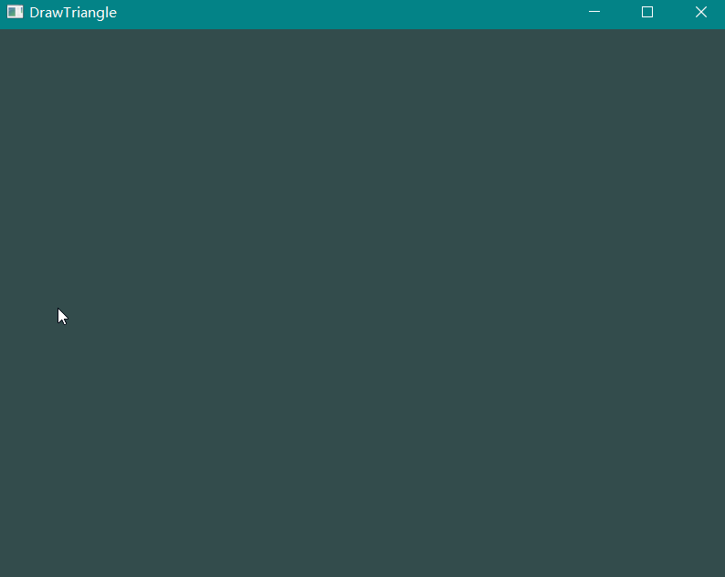
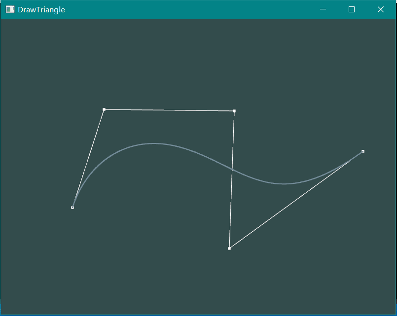

# Homework 8 - Bezier Curve

**16340256 谢玮鸿**  

---

### Basic: 
> 1. 用户能通过左键点击添加Bezier曲线的控制点，右键点击则对当前添加的最后一个控制点进行消除。
> 2. 工具根据鼠标绘制的控制点实时更新Bezier曲线。

### Bonus:  
> 1. 可以动态地呈现Bezier曲线的生成过程。



#### **（一）Bezier曲线**

以一个三阶Bezier曲线为例，说明它的绘制过程。该三阶曲线包括四个控制点，分别为 P0, P1, P2, P3  


首先，四个控制点先后连接，形成3段线段，即P0P1, P1P2, P2P3。设参数 t ∈ [0,1]，在三条线段上分别选择一个点 Pk' 使得 PkPk' = tPkP(k+1)。如下图所示：  


然后重复上述步骤，连接$P_0'$, $P_1'$, $P_2'$三个点，并继续选择$P_k''$。最后连接到只有一条线段，在这线段上选择的点就是t参数对应的Bezier曲线上的点。将$t \in [0,1]$对应的所有点连接起来，即是所求的Bezier曲线。


更明显的动图效果如下：


给定点 P0, P1, ... , Pn，一般Bezier曲线可以表示为：


#### **（二）实现捕捉鼠标移动和点击**

首先要确保能够交互，要捕获鼠标移动和左右键的点击。

定义一个类，用于存储点的坐标。使用一个vector（或stack）存储用户点击过的点，可以满足点的后进先出。另外使用xCur, yCur变量来记录鼠标的移动。
``` c++
// 存储点坐标的类
class Point
{
	public:
		float x, y;
		void setxy(float _x, float _y) {
			x = _x;
			y = _y;
		}
};

float xCur, yCur;	// 记录鼠标实时位置
vector<Point> pointSet;
```

然后，定义两个函数，分别用于捕获鼠标的移动和点击事件。比较重要的一点是，捕获鼠标移动时，需要根据窗口大小进行坐标转换，才能得到正确的鼠标位置。左键点击时，新建一个Point对象，放进pointSet的末尾；右键点击时，从pointSet的末尾删掉一个Point对象。
``` c++
// process mouse cursor 实时记录当前坐标
void mouse_move_callback(GLFWwindow* window, double xpos, double ypos) {
	// xCur = xpos; 
	// yCur = ypos; 
	xCur = (xpos - SCR_WIDTH / 2) / SCR_WIDTH * 2;
	yCur = 0  - (ypos - SCR_HEIGHT / 2) / SCR_HEIGHT * 2;
};

// process mouse button input
void mouse_button_callback(GLFWwindow* window, int button, int action, int mods)
{
	// 左键将当前点加入到pointSet
	if (button == GLFW_MOUSE_BUTTON_LEFT && action == GLFW_PRESS) {
		Point point;
		point.setxy(xCur, yCur);
		pointSet.push_back(point);
	}

	// 右键删除pointSet最后一个元素
	if (action == GLFW_PRESS && button == GLFW_MOUSE_BUTTON_RIGHT) {
		if (!pointSet.empty())
			pointSet.pop_back();
	}
}
```

然后设置回调函数即可。  
``` c++
	glfwSetCursorPosCallback(window, mouse_move_callback);		//鼠标移动回调函数
	glfwSetMouseButtonCallback(window, mouse_button_callback);	//鼠标点击回调函数
```

#### **（三）绘制Bezier曲线**  
在渲染的过程中，将pointSet中的每一个点绘制出来，并将每邻接的两个点绘制成直线。然后绘制Bezier曲线。绘制点和线的函数在之前的作业中已经实现过，这里不再贴出。

``` c++
// Draw Line & Points
for (int i = 0; i < pointSet.size(); i++) {
    drawPoint(shaderProgram, pointSet[i].x, pointSet[i].y, 5.0f, point_color);
    if (i > 0)
        drawLine(shaderProgram, pointSet[i-1].x, pointSet[i-1].y, pointSet[i].x, pointSet[i].y, point_color);
}

// Draw Bezier Curve  
if (pointSet.size() > 1)
    drawBezierCurve(shaderProgram, line_color);
```

具体的绘制过程，基本就是计算相关了。

由于对于不同的 $t \in [0,1]$，二项式系数都是一样的，因此先计算好二项式系数再带入参数t计算会更快。求二项式系数有很多高效的实现方法，但是考虑到用户输入的点数n不会太大，因此我使用直接计算的方法，减少复杂性。

计算好二项式系数之后，计算 t ∈ [0,1] 对应的 B(t)，然后将点绘制出，即得到了Bezier曲线。

``` c++
void drawBezierCurve(const int &shaderProgram, ImVec4 color) {
	int size = pointSet.size();
	int n = size - 1;	// 0, 1, ... , n 共n+1个点
	float *B = new float[size];	// 多项式的常数系数

	// 求二项式系数C_n^k，由于数据量不大，采用比较直接的方法求，为了防止数据溢出，采用一边乘一边除的方法
	for (int i = 0; i < size; i++) {
		int k = i, x = 1;
		float c = 1.0;
		if (k > n - k)
			k = n - k;
		for (int j = n; j > n - k; j--, x++)
			c *= (float)j / x;

		B[i] = c;
	}
		
	for (float t = 0.0; t < 1.0; t += delta) {
		float x = 0.0, y = 0.0, tmp;
		for (int i = 0; i <= n; i++) {
			tmp = B[i] * pow(t, i) * pow(1 - t, n - i);
			x += tmp * pointSet[i].x;
			y += tmp * pointSet[i].y;
		}
		drawPoint(shaderProgram, x, y, 2.0f, color);
	}
}
```

绘制效果如下：  


#### **（四）动态呈现Bezier曲线的生成过程**  

动态呈现生成过程实质上就是一个递归画线段的过程。输入一组点坐标points，以及  t ∈ [0,1]，求出参数t对应的新的一组点的坐标new_points，将邻近的两个点绘制成线段，然后以new_points为输入（如果点的数量不为1的话），递归调用该函数。

``` c++
void drawTangent(const int &shaderProgram, vector<Point> points, float t, ImVec4 color)
{
	vector<Point> new_points;
	float x1, y1, x2, y2;
	Point point;

	// 第一个点
	if (points.size() < 2)
		return;
	x2 = points[0].x + t * (points[1].x - points[0].x);
	y2= points[0].y + t * (points[1].y - points[0].y);
	point.setxy(x2, y2);
	new_points.push_back(point);
	drawPoint(shaderProgram, x2, y2, 2.0f, color);

	// 开始画第二个点
	for (int i = 2; i <= points.size() - 1; i++) {
		x1 = x2;
		y1 = y2;
		x2 = points[i - 1].x + t * (points[i].x - points[i - 1].x);
		y2 = points[i - 1].y + t * (points[i].y - points[i - 1].y);
		point.setxy(x2, y2);
		new_points.push_back(point);
		drawPoint(shaderProgram, x2, y2, 2.0f, color);

		drawLine(shaderProgram, x1, y1, x2, y2, color);
	}

	// 递归
    if (new_points.size() > 1)
	    drawTangent(shaderProgram, new_points, t, color);
}
```

